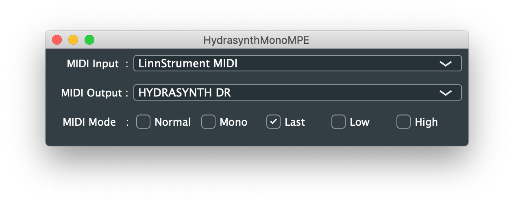

Use to route midi from an MPE controller to a Hydrasynth to fix a few bugs with mono patches and add a proper mono/last mode.

If Hydrasynth path is:
1. Poly choose Normal in app.
2. Mono or Unison choose Mono or Last in app.
3. Mono Lo or UnisonLo choose Low in app.
4. Mono Hi or UnisonHi choose High in app.

Existing Hydrasynth (up to 1.4.0) Bugs for mono patches with MPE turned on:

1. Playing the same note more than once and releasing one of them also stops the other note.
2. Holding a note and then bending another note and releasing changes the pitch of the original note.
3. Pitchbend on notes not playing effects playing notes, PB from all notes fight against each other.

The Hydrasynth Mono mode also high note priority when you release a key, I have added a Last note priority mode.

Unsigned binaries are available in the BIN folder for OSX and Windows, if you cannot or will not run unsigned binaries you will have to build it yourself, look further down:

OSX HydrasynthMonoMPE.app.zip checksums
---------------------------------------
MD5: fb627ef185849931379b886626873d11
sha256: 5caf4f514f183874fbda6e2fe560833aeda97f629f544c93975e41a252e82176

Windows HydrasynthMonoMPE.zip
-----------------------------
MD5: 079cf2c91a3785511535667112676b4e
sha256: 619f0992b4ab15c4c6dd1e037d31af862aa390080c82efef493091f4a05cc530

    This program is free software: you can redistribute it and/or modify
    it under the terms of the GNU General Public License as published by
    the Free Software Foundation, either version 3 of the License, or
    (at your option) any later version.

    This program is distributed in the hope that it will be useful,
    but WITHOUT ANY WARRANTY; without even the implied warranty of
    MERCHANTABILITY or FITNESS FOR A PARTICULAR PURPOSE.  See the
    GNU General Public License for more details.

    see https://www.gnu.org/licenses/ 
    

To build this you need to download Juce from: https://shop.juce.com/get-juce

You need the required development tools for your platfrom.

Then clone this repository and load HydrasynthMonoMPE.jucer into the juce projucer application, start the dev tools from there and build it.

